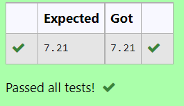

# DISTANCE-BETWEEN-TWO-POINTS

## AIM:
To write a python program to find the distance two 2 points
## ALGORITHM:
### Step 1: 
Import the math library to solve using distance formula
### Step 2: 
Enter the given matrices
### Step 3: 
Substitute the values in the distance formula  

### Step 4: 
Print the output with two values after decimal 
### PROGRAM:
``` python
#python program to find the distance two 2 points
#Developed by : R.Guruprasad
#Ref no: 22006697
import math
m=[10,6]
n=[4,2]
d=math.sqrt((m[0]-n[0])**2 +(m[1]-n[1])**2)
print("{:.2f}".format(d))
  

  

```


### OUTPUT:


### RESULT:
The distance between 2 points is found successfuly.
